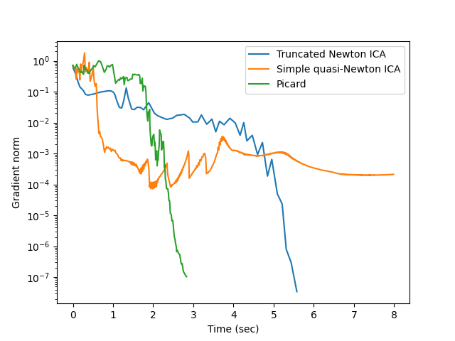

Installation
------------

Clone the repository::

  $ git clone https://github.com/pierreablin/faster-ica.git
  $ cd faster-ica
  $ pip install -e .

The easiest way to get started is to run the benchmark::

  $ python examples/benchmark.py

Dependencies
------------

These are the dependencies to run the algorithms:

* numpy (>=1.8)
* matplotlib (>=1.3)
* numexpr (>= 2.0)
* scipy (>=0.19)

Results
---------------

Acknowledgments
--------------

This project code is from the Picard algorithm implementation, originally authored by Pierre Ablin and collaborators.  
The implementation is licensed under the BSD 3-Clause License.  
See the `LICENSE` file for more details.

